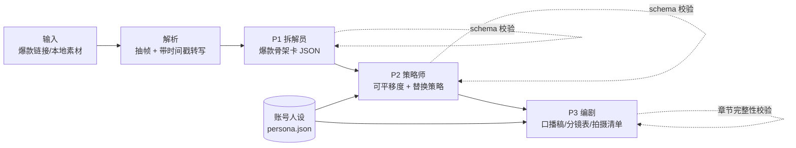

# StarPick 摘星

> 对标爆款「拆解 → 平移」Agent：粘贴一条爆款链接，3 分钟拿到一份按你的人设与产品改写好的可拍脚本。
>
> 「小满摘星计划」笔试 · 方向三 内容AI · MVP 代码仓库 ｜ 申请人：金林松

## 它解决什么问题

短视频博主和种草商家做内容的标准动作是"找对标、拆对标、平移到自己"——但拆解全靠手工（60-90 分钟/条），
买别人拆好的要 ¥9-198/份（闲鱼/淘宝真实在售、已售 90+）。通用 AI 直接写脚本则是"正确的废话"：没有被验证的结构依据。

StarPick 把这个真实付费的工作流产品化：**保留爆款骨架，替换为你的血肉**。

## 快速开始

### 1. 离线演示（零依赖、零 Key，30 秒）

```bash
make demo    # MockLLM 回放金样，完整跑通五段流水线，产出 output/report.md
make test    # 42 项单元 + E2E 测试（stdlib unittest，无第三方依赖）
```

### 2. 真实运行（任配一个 API Key）

| 供应商 | 环境变量 | 默认模型 |
|---|---|---|
| DeepSeek | `DEEPSEEK_API_KEY` | deepseek-chat |
| 通义千问（阿里百炼） | `DASHSCOPE_API_KEY` | qwen-plus |
| Kimi（月之暗面） | `MOONSHOT_API_KEY` | moonshot-v1-32k |
| OpenAI / 任意兼容网关 | `OPENAI_API_KEY`（可选 `OPENAI_BASE_URL`） | gpt-4o-mini |
| Anthropic Claude | `ANTHROPIC_API_KEY` | claude-sonnet-4-6 |

```bash
export DEEPSEEK_API_KEY=sk-...      # 任选其一即可
python3 -m starpick                  # auto 自动探测已配置的 Key
python3 -m starpick --provider qwen  # 或显式指定
```

模型可用 `STARPICK_MODEL` 统一覆盖（如 `STARPICK_MODEL=deepseek-reasoner`）。

### 3. 原型页真跑（产品 Demo）

```bash
python3 -m starpick.server --offline          # 无 Key：金样回放
DEEPSEEK_API_KEY=sk-... python3 -m starpick.server   # 有 Key：真实模型
```

浏览器打开 `http://127.0.0.1:8765`，原型含 **首页 / 工作台 / 历史记录 / 我的人设** 四个页面：
工作台点「拆解」即通过 `POST /api/analyze` 真正跑一遍 P1→P2→P3，顶栏显示 `LIVE · 引擎与模型`；
每次拆解自动存入「历史记录」（localStorage），可载入复看。
直接双击 `demo/index.html`（不起服务端）则回退内置样例；`?view=work` 可直达工作台。

## 架构



五段流水线：**输入 → 解析 → 拆解(P1) → 注入(P2) → 平移(P3)**。
每段产出先过 `schema.py` 校验再进下一段；任何一段不合约定，带阶段名立即失败。

```
starpick/
├── prompts/            # P1/P2/P3 完整 Prompt（模板即代码，被测试钉死契约）
├── starpick/
│   ├── ingest.py       # 素材接入层（本地 fixture 已实现；链接采集为 W2 路线图，接口已留）
│   ├── prompts.py      # 模板加载与渲染（残留占位符即报错）
│   ├── schema.py       # 骨架卡/策略/脚本 三级校验
│   ├── llm.py          # 多供应商客户端 + make_llm 工厂 + MockLLM（金样回放）
│   ├── pipeline.py     # 五段编排与报告生成
│   ├── server.py       # 本地服务端：原型页直连真实流水线（POST /api/analyze）
│   └── cli.py          # 命令行入口
├── fixtures/
│   ├── sample_video/   # 演示素材：转写 + 1fps 画面标注
│   ├── persona_office.json
│   └── golden/         # 三阶段金样（E2E 基准，也是离线演示数据源）
├── tests/              # 42 项单元 + E2E 测试（含工厂逻辑、服务端 HTTP 链路、容错重试）
├── demo/index.html     # 多页面产品原型：首页/工作台/历史(localStorage)/人设，连服务端真跑
├── evidence_links.md   # 用户证据可点击链接清单（对应一页纸脚注）
└── .github/workflows/  # CI：lint + 测试 + 离线 demo 冒烟，Python 3.11/3.12 矩阵
```

## 工程决策

| 决策 | 理由 |
|---|---|
| 标准库零依赖 | 评委 `git clone` 后无需任何安装即可复现；验证期最小化环境摩擦 |
| Mock 层与真实 LLM 同接口 | E2E 测试确定性、零成本；切真实模型只换一个对象 |
| 多供应商 OpenAI 兼容层 | 国内可用的 DeepSeek/通义/Kimi 任一 Key 即可真跑，不绑定单一厂商 |
| Prompt 当代码管理 | 模板进版本库、占位符渲染有断言、输出契约被单测钉死（如"禁止复用原台词"有回归测试） |
| 每阶段 schema 校验 | LLM 输出不可信是工程事实；失败要发生在阶段边界而不是用户面前 |
| 容错解析＋带反馈重试 | 真实模型偶发不合规（未转义引号/尾逗号/围栏外闲话）：自动修复，仍失败则把拒绝原因拼回 Prompt 重试 2 次 |
| 链接采集留接口不硬做 | 反爬是 W2 要验证的风险项（插件端采集），不在 MVP 期伪造能力 |

## 两周验证路线图（对应一页纸 ⑤）

- **D1-3** 跑通线上模型版，30 张骨架卡校准 Prompt（评分一致性抽检）
- **D4-7** 20 名种子博主 1v1 人机混合交付（Wizard of Oz），记录"是否照脚本实拍"
- **D8-10** 浏览器插件采集通道 + ¥9.9 体验包落地页
- **D11-14** 流失访谈、Prompt 迭代、1 家代运营商家矩阵试点
- **Go/Kill**：≥30% 种子用户实拍 / ≥15% 付费转化 / 次周复用 ≥40%，任两项达标继续

## 说明

`fixtures/sample_video` 为演示用合成样例（结构对应真实美妆爆款常见范式），
避免在公开仓库中引用真实博主的受版权保护内容；接真实链接后由解析层自动生成同格式素材。
